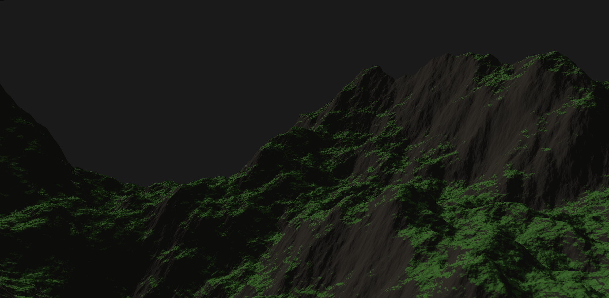

# 🌿 Sylva — GPU-Driven Foliage Renderer

**Sylva** is a prototype showcasing **GPU-driven foliage rendering**, combining compute-based generation and raster rendering using [**Daxa**](https://daxa.dev/), a modern Vulkan wrapper.

Sylva requires the **Vulkan SDK** to be installed and available in your system’s environment.
You can obtain it from [LunarG’s Vulkan SDK](https://vulkan.lunarg.com/).

---

## Roadmap

### Core Engine

- [x] Camera controls + navigation
- [x] Vulkan backend using Daxa
- [x] ImGui integration

### Terrain System

- [x] Procedural heightfield generation (noise-based)
- [x] Terrain material maps (albedo, normal)
- [x] Tessellated terrain rendering with dynamic LOD

### Grass & Foliage System

**Grass blades**

- [ ] Grass chunk generation
- [ ] Clump distribution
- [ ] Per-blade geometry
- [ ] Blade fullness transforms
- [ ] Grass shading (Phong/glossy, color variation)

**Others**

- [ ] Ground-cover foliage (moss, small plants)
- [ ] (Optional) Additional foliage types inside grass clumps

### Visual Effects & Interaction

- [ ] Screen-space grass shadows
- [ ] Wind simulation
- [ ] Object–grass interaction
- [ ] (Optional) translucency / subsurface scattering

### Performance & Optimization

- [ ] Grass culling (frustum & distance-based)
- [ ] LOD system (density + blade complexity)

---

## 🛠️ Building Sylva

Sylva is developed in C++20 and built using CMake (version 3.21 or higher). It uses build presets for streamlined configuration.

### Example (Windows + MSVC)

#### 1. Configure the project

```bash
cmake --preset cl-x86_64-windows-msvc
```

#### 2. Build (Debug preset)

```bash
cmake --build --preset cl-x86_64-windows-msvc-debug
```

#### 3. Run the executable

```bash
.\build\cl-x86_64-windows-msvc\Debug\sylva.exe
```

(Adjust the path as needed for your platform and configuration.)

<details>
  <summary><b>Show Current Project Progress</b></summary>

_Procedural terrain generation_



</details>
